# AMEDEO-P-AEROSPACE-DEFENSE-AND-GROUND-SYSTEMS
## Airframes, Mechanical, Environmental, Digital/Distributed, Energy, Operating, Propulsion Systems (A.M.E.D.E.O.P.).
### Comprehensive framework for next generation systems in every aerospace industry segment: Air, Space, Defense, Ground and Cross domains.

---

[]()
[]()
[]()
[]()
[]()
[]()

---

## **📋 Table of Contents**

1.  [Overview](#overview)
2.  [System Definition](#system-definition)
3.  [Architecture](#architecture)
4.  [Directory Structure](#directory-structure)
5.  [Configuration Item Structure](#configuration-item-structure)
6.  [Lifecycle Management](#lifecycle-management)
7.  [Standards & Certification](#standards--certification)
8.  [Implementation Guide](#implementation-guide)
9.  [Digital Thread & Twin](#digital-thread--twin)
10. [Metrics & Analytics](#metrics--analytics)
11. [Contributing](#contributing)
12. [License](#license)
13. [Support](#support)

---

## **Overview**

**AMEDEO-P** is a comprehensive framework for next-generation aerospace systems engineering, providing **complete cradle-to-grave lifecycle management** across all aerospace industry segments. Version 3.0 introduces an enhanced 11-phase Configuration Item structure that spans from initial requirements through end-of-life recycling.

### **Quick Facts**

-   **Total Systems**: 3,920
-   **Constituent Assemblies**: 3,920
-   **Configuration Items**: 39,200
-   **Lifecycle Phases**: 11 (Requirements → Recycling)
-   **Total Files**: ~15.7 million
-   **Data Volume**: ~78TB
-   **Domains**: AIR, SPACE, DEFENSE, GROUND, CROSS

---

## **System Definition**

### **AMEDEO-P Acronym**

The AMEDEO-P framework represents seven critical technical categories:

| Letter | Category | Description |
| :--- | :--- | :--- |
| **A** | **Airframes** | Structural systems, materials, and architectural frameworks |
| **M** | **Mechanical** | Actuation, mechanisms, and kinematic systems |
| **E** | **Environmental** | Life support, thermal, and protection systems |
| **D** | **Digital/Distributed** | Computing, networks, and information systems |
| **E** | **Energy** | Power generation, storage, and distribution |
| **O** | **Operating Systems** | Procedures, logistics, and operational frameworks |
| **P** | **Propulsion** | Thrust generation and propulsive systems |

---

## **Architecture**

### **Hierarchical Structure**

```
DOMAIN → CATEGORY → SYSTEM → CONSTITUENT ASSEMBLY (CA) → CONFIGURATION ITEMS (CI) → LIFECYCLE PHASES
```

### **Enhanced Lifecycle Coverage**

```mermaid
graph LR
    A[01-Requirements] --> B[02-Design]
    B --> C[03-Building & Prototyping]
    C --> D[04-Executables & Packages]
    D --> E[05-Verification & Validation]
    E --> F[06-Integration & Qualification]
    F --> G[07-Certification & Security]
    G --> H[08-Production Scale]
    H --> I[09-Ops & Services]
    I --> J[10-MRO]
    J --> K[11-Sustainment & Recycle]
    K -.-> A
    
    style A fill:#e1f5fe
    style K fill:#c8e6c9
```



---

## **Directory Structure**

La arquitectura de directorios de AMEDEO-P es la columna vertebral del sistema. Está diseñada para ser lógicamente navegable, legible por máquina y completamente auditable, separando claramente la documentación empresarial de los datos técnicos de ingeniería.

### **Root Structure**

La raíz del repositorio contiene los archivos de configuración del proyecto y los directorios de más alto nivel.

```bash
AMEDEO-P-AEROSPACE-DEFENSE-AND-GROUND-SYSTEMS/
│
├── README.md                    # Este archivo, el punto de entrada principal
├── LICENSE.md                   # Licencia de propiedad y términos de uso
├── CONTRIBUTING.md             # Guía para colaboradores y estándares de desarrollo
├── CHANGELOG.md                # Historial de versiones y cambios significativos
├── CODE_OF_CONDUCT.md          # Estándares de conducta para la comunidad
├── SECURITY.md                 # Políticas y procedimientos de seguridad
│
├── .github/                    # Archivos específicos de GitHub para automatización
│   ├── workflows/              # Flujos de trabajo de CI/CD (ej. linting, testing, deployment)
│   ├── ISSUE_TEMPLATE/         # Plantillas para reportar issues
│   └── PULL_REQUEST_TEMPLATE/  # Plantillas para Pull Requests
│
├── docs/                       # ORGANIZATIONAL & BUSINESS DOCUMENTATION (ver detalle completo abajo)
├── tools/                      # Herramientas de sistema y automatización
├── templates/                  # Plantillas para cada fase del ciclo de vida de un CI
│
└── UTCS/                       # UNIFIED TRACEABILITY & CONFIGURATION SYSTEM (ver detalle completo abajo)
```

### **`docs/` - Organizational & Business Documentation (Full Structure)**

Este directorio contiene toda la información no técnica que gobierna la empresa y sus programas. Cada categoría está completamente detallada.

```bash
docs/
├── 01-GOVERNANCE/
│   ├── Board-Structure.md
│   ├── Executive-Committee-Charter.pdf
│   ├── Technical-Steering-TOR.md
│   └── Policies-Procedures/
│       ├── P001-Code-of-Conduct.pdf
│       └── P002-IP-Policy.pdf
│
├── 02-FINANCIAL/
│   ├── Business-Case-AMEDEO-P.xlsx
│   ├── ROI-Analysis-Q3-2024.pdf
│   ├── Cost-Models/
│   │   └── System-Cost-Model-Template.xlsm
│   └── Budget-Planning-FY2025.mpp
│
├── 03-LEGAL-CONTRACTS/
│   ├── Master-Service-Agreements/
│   ├── Non-Disclosure-Agreements/
│   ├── IP-Management-Plan.pdf
│   └── ITAR-Compliance-Manual.pdf
│
├── 04-PROGRAM-MANAGEMENT/
│   ├── Program-Charter-v3.pdf
│   ├── Roadmaps/
│   │   ├── Technology-Roadmap-2025-2030.vsdx
│   │   └── Product-Roadmap-Air-Domain.pptx
│   ├── Milestone-Planning-Schedule.mpp
│   └── Risk-Register-Master.xlsx
│
├── 05-HUMAN-RESOURCES/
│   ├── Organizational-Structure-Chart.vsdx
│   ├── RACI-Matrix-Program.xlsx
│   ├── Training-Programs/
│   │   └── DO-178C-Training-Material.zip
│   └── Competency-Framework.pdf
│
├── 06-QUALITY-MANAGEMENT/
│   ├── Quality-Management-System-Manual.pdf
│   ├── Process-Maps/
│   │   └── Design-Review-Process.bpmn
│   ├── KPI-Definitions.md
│   └── Audit-Program-Schedule.pdf
│
├── 07-SUPPLY-CHAIN/
│   ├── Vendor-Database.accdb
│   ├── Sourcing-Strategy.pdf
│   ├── Make-Buy-Decisions/
│   │   └── MBD-Fuselage-Components.pdf
│   └── Supplier-Risk-Assessment.xlsx
│
├── 08-SALES-MARKETING/
│   ├── Market-Analysis-Report.pdf
│   ├── Customer-Segments.md
│   ├── Pricing-Strategy-Model.xlsx
│   └── Brand-Guidelines.pdf
│
├── 09-STRATEGY-PLANNING/
│   ├── Strategic-Plan-2025-2030.pdf
│   ├── Technology-Roadmap.vsdx
│   ├── Market-Expansion-Plan-APAC.docx
│   └── Partnership-Strategy.md
│
├── 10-FACILITIES-INFRASTRUCTURE/
│   ├── Site-Locations-Overview.kml
│   ├── Facility-Layout-Manufacturing.dwg
│   ├── IT-Infrastructure-Architecture.vsdx
│   └── EHS-Manual.pdf
│
├── 11-REGULATORY-AFFAIRS/
│   ├── Regulatory-Strategy.pdf
│   ├── Agency-Relations-Contacts.xlsx
│   ├── Compliance-Calendar.ics
│   └── Submission-Planning-FAA.mpp
│
└── 12-COMMUNICATIONS/
    ├── Internal-Communications-Plan.pdf
    ├── External-Relations-Strategy.pdf
    ├── Crisis-Management-Playbook.pdf
    └── Investor-Relations-Deck-Q3-2024.pptx
```

### **`UTCS/` - Unified Traceability & Configuration System (Full Examples)**

El corazón técnico del framework. A continuación, ejemplos completos sin omisiones para ilustrar la profundidad.

#### **Ejemplo 1: Hardware en `AIR` - Fuselage Skin Panel (CI-AA001-001)**

```bash
UTCS/AIR/Airframes/System-001-FuselageStructure/CA-AA001/CI-AA001-001/
├── 01-REQUIREMENTS/
│   ├── SRS-SkinPanel-v1.2.docx
│   └── Traceability-Matrix-Reqs-to-Design.xlsx
│
├── 02-DESIGN/
│   ├── CAD/
│   │   ├── SkinPanel_Assy_v1.2.CATPart
│   │   └── SkinPanel_Drawing_v1.2.CATDrawing
│   ├── FEM/
│   │   ├── Static-Load-Analysis-Report.pdf
│   │   └── Vibration-Modal-Analysis.fem
│   └── Material-Specification-Al-2024-T3.pdf
│
├── 03-BUILDING-PROTOTYPING/
│   ├── Manufacturing-Process-Sheet-v1.0.pdf
│   └── Material-Traceability-Log-Prototype-001.csv
│
├── 04-EXECUTABLES-PACKAGES/
│   └── Final-Design-Package-For-Manufacturing-v1.2.zip
│
├── 05-VERIFICATION-VALIDATION/
│   ├── V&V-Plan-SkinPanel.pdf
│   ├── Results/
│   │   ├── Fatigue-Test-Cycle-1M-Results.csv
│   │   └── Static-Load-Test-Report.pdf
│   └── V&V-Summary-Report.pdf
│
├── 06-INTEGRATION-QUALIFICATION/
│   ├── Integration-Test-Plan.pdf
│   ├── Fit-Check-Report-On-Fuselage-Jig.pdf
│   └── Corrosion-Resistance-Qualification-Test.pdf
│
├── 07-CERTIFICATION-SECURITY/
│   ├── FAA-Form-8130-3_Airworthiness-Tag.pdf
│   ├── EASA-Form-1_Authorized-Release-Cert.pdf
│   └── Compliance-Checklist-ARP4754A.xlsx
│
├── 08-PRODUCTION-SCALE/
│   ├── QC-Inspection-Reports-Batch-001.xlsx
│   ├── Production-Yield-Data-Q3-2025.csv
│   └── First-Article-Inspection-Report.pdf
│
├── 09-OPS-SERVICES/
│   ├── Installation-Procedure-Manual-IP-SP-001.pdf
│   └── Handling-and-Storage-Guide.pdf
│
├── 10-MRO/
│   ├── Maintenance-Manual-Chapter-53.pdf
│   ├── Inspection-Checklist-Corrosion-Control.md
│   └── Repair-Scheme-RS-SP-004.pdf
│
└── 11-SUSTAINMENT-RECYCLE-EOL/
    ├── Material-Recycling-Plan-Aluminum.pdf
    └── End-Of-Life-Disposal-Certificate.pdf
```

#### **Ejemplo 2: Software en `AIR` - Flight Plan Engine (CI-AD432-002)**

```bash
UTCS/AIR/Digital_Distributed/System-432-FlightManagementSystem/CA-AD432/CI-AD432-002/
├── 01-REQUIREMENTS/
│   ├── SW-HighLevel-Requirements.md
│   ├── SW-LowLevel-Requirements.json
│   └── DO-178C-DAL-A-Requirements-Trace.xlsx
│
├── 02-DESIGN/
│   ├── Software-Design-Document-SDD.md
│   ├── Interface-Control-Document-ICD.json
│   └── UML-Diagrams/
│       ├── Sequence-Diagram-Create-FlightPlan.png
│       └── Class-Diagram-Core-Objects.vsdx
│
├── 03-BUILDING-PROTOTYPING/
│   ├── src/
│   │   ├── main.c
│   │   └── algorithms/waypoint_calc.c
│   ├── include/
│   │   └── flightplan.h
│   └── CMakeLists.txt
│
├── 04-EXECUTABLES-PACKAGES/
│   ├── bin/
│   │   └── FlightPlanEngine_v3.0.0.so
│   ├── build-log-v3.0.0.txt
│   └── Release-Notes-v3.0.0.md
│
├── 05-VERIFICATION-VALIDATION/
│   ├── tests/
│   │   └── test_waypoint_calc.c
│   ├── coverage/
│   │   └── GCOV-Coverage-Report-99.8-percent.html
│   ├── Static-Analysis-Report-MISRA.xml
│   └── Test-Results-Unit-Tests.json
│
├── 06-INTEGRATION-QUALIFICATION/
│   ├── Hardware-Software-Integration-Test-Results.log
│   └── Target-Processor-Performance-Metrics.csv
│
├── 07-CERTIFICATION-SECURITY/
│   ├── Plan-for-Software-Aspects-of-Certification-PSAC.pdf
│   ├── Software-Accomplishment-Summary-SAS.pdf
│   └── Security-Vulnerability-Scan-Report.xml
│
├── 08-PRODUCTION-SCALE/
│   ├── Golden-Image-v3.0.0.bin
│   └── Flashing-Tool-Config-v3.0.0.ini
│
├── 09-OPS-SERVICES/
│   ├── FMS-Flight-Planning-User-Manual-Extract.pdf
│   └── Field-Loadable-Software-Bulletin-SB-FMS-012.pdf
│
├── 10-MRO/
│   ├── Patch-v3.0.1-Release-Notes.md
│   └── Software-Update-Procedure-UP-FPE-001.pdf
│
└── 11-SUSTAINMENT-RECYCLE-EOL/
    ├── Software-Decommissioning-Plan.pdf
    └── Data-Archival-Certificate.pdf
```

---

## **Configuration Item Structure**

### **NEW 11-Phase CI Structure**

Each Configuration Item (CI) follows a comprehensive cradle-to-grave lifecycle:

| Phase | Name | Purpose | Key Deliverables |
| :--- | :--- | :--- | :--- |
| **01** | **REQUIREMENTS** | Define system needs | SRS, ICD, Traceability Matrix |
| **02** | **DESIGN** | Architect solution | SAD, DDD, 3D Models |
| **03** | **BUILDING & PROTOTYPING** | Create initial implementation | Source Code, Prototypes |
| **04** | **EXECUTABLES & PACKAGES** | Generate deployable artifacts | Binaries, Containers |
| **05** | **VERIFICATION & VALIDATION** | Prove correctness | Test Reports, Coverage |
| **06** | **INTEGRATION & QUALIFICATION** | Environmental testing | Qualification Reports |
| **07** | **CERTIFICATION & SECURITY** | Regulatory approval | Certificates, Audits |
| **08** | **PRODUCTION SCALE** | Mass manufacturing | Production Data, QC |
| **09** | **OPS & SERVICES** | Operational support | Manuals, Training |
| **10** | **MRO** | Maintenance & Repair | Maintenance Plans |
| **11** | **SUSTAINMENT & RECYCLE** | End-of-life management | Recycling, Disposal |

---

## **Lifecycle Management**

### **Phase Transition Gates**

-   **SRR**: System Requirements Review
-   **PDR**: Preliminary Design Review
-   **CDR**: Critical Design Review
-   **TRR**: Test Readiness Review
-   **QR**: Qualification Review
-   **CA**: Certification Approval
-   **PRR**: Production Readiness Review
-   **ORR**: Operational Readiness Review
-   **EOL**: End of Life Decision

### **Lifecycle Metrics**

-   Requirements Coverage: 98.5%
-   Design Completion: 96.2%
-   Code Quality: 94.8%
-   Test Coverage: 92.3%
-   Certification Progress: 78.4%
-   Production Yield: 97.2%
-   Operational Availability: 99.3%
-   Recycling Rate: 72.8%

---

## **Standards & Certification**

### **Aviation (AIR Domain)**

-   **DO-178C**: Software Considerations
-   **DO-254**: Hardware Design Assurance
-   **ARP4754A**: System Development
-   **ARP4761**: Safety Assessment

### **Space (SPACE Domain)**

-   **ECSS-E-ST-40C**: Software Engineering
-   **ECSS-Q-ST-80C**: Software Quality
-   **NASA-STD-8739.8**: Software Assurance
-   **CCSDS**: Data Standards

### **Defense (DEFENSE Domain)**

-   **MIL-STD-882E**: System Safety
-   **MIL-STD-498**: Software Development
-   **STANAG 4404**: NATO Safety Design
-   **DO-326A**: Cybersecurity

### **Ground (GROUND Domain)**

-   **ICAO Annex 14**: Aerodromes
-   **IATA ISAGO**: Ground Operations
-   **ACI**: Airport Standards
-   **ISO 9001**: Quality Management

---

## **Implementation Guide**

### **Phase 1: Foundation (Q3 2024 - Current)**

-   ✅ Deploy base directory structure
-   ✅ Define 11-phase lifecycle model
-   🔄 Implement CI templates for all phases
-   🔄 Setup organizational documentation framework
-   ⏳ Initialize first 100 pilot CIs

### **Phase 2: Expansion (Q4 2024 - Q1 2025)**

-   Scale to 1,000 CIs across all domains
-   Populate organizational documentation
-   Implement digital thread connectivity
-   Deploy lifecycle management tools

### **Phase 3: Integration (Q2-Q3 2025)**

-   Complete all 39,200 CIs structure
-   Activate digital twin synchronization
-   Full traceability implementation
-   Certification readiness assessment

### **Phase 4: Operations (Q4 2025+)**

-   Production deployment
-   Continuous improvement
-   Technology refresh cycles
-   Sustainment planning activation

---

## **Digital Thread & Twin**

### **Digital Thread Implementation**

-   **Bidirectional Traceability**: Requirements ↔ EOL
-   **Real-time Synchronization**: 1Hz update rate
-   **Impact Analysis**: Automated change propagation
-   **Version Control**: Git-based configuration management

### **Digital Twin Architecture**

```yaml
digital_twin:
  models:
    - as_designed: CAD/CAE models
    - as_built: Manufacturing deviations
    - as_operated: Real-time sensor data
    - as_maintained: Maintenance history
  
  analytics:
    - predictive_maintenance
    - performance_optimization
    - anomaly_detection
    - remaining_useful_life
    
  synchronization:
    protocol: MQTT/AMQP
    frequency: 1-1000Hz
    latency: <100ms
```

---

## **Metrics & Analytics**

### **System-Wide KPIs**

| Metric | Current | Target | Status |
| :--- | :--- | :--- | :--- |
| System Availability | 99.3% | 99.5% | 🟡 |
| MTBF | 2,500 hrs | 3,000 hrs | 🟡 |
| MTTR | 4.2 hrs | 4.0 hrs | 🟡 |
| First Pass Yield | 97.2% | 98% | 🟢 |
| Schedule Performance | 94% | 95% | 🟡 |
| Cost Performance | 92% | 95% | 🟡 |

### **Domain Distribution**

| Domain | Systems | CAs | CIs | Completion |
| :--- | :--- | :--- | :--- | :--- |
| AIR | 1,400 | 1,400 | 14,000 | 45% |
| SPACE | 700 | 700 | 7,000 | 38% |
| DEFENSE | 1,050 | 1,050 | 10,500 | 42% |
| GROUND | 350 | 350 | 3,500 | 52% |
| CROSS | 420 | 420 | 4,200 | 35% |

---

## **Contributing**

### **How to Contribute**

1.  Fork the repository
2.  Create feature branch (`git checkout -b feature/AmazingFeature`)
3.  Commit changes (`git commit -m 'Add AmazingFeature'`)
4.  Push to branch (`git push origin feature/AmazingFeature`)
5.  Open Pull Request

### **Contribution Standards**

-   Follow DO-178C coding standards
-   Maintain 90% test coverage
-   Document all public APIs
-   Pass all CI/CD checks
-   Obtain 2 peer reviews

### **Code Review Checklist**

-   [ ] Requirements traced
-   [ ] Design documented
-   [ ] Tests implemented
-   [ ] Coverage >90%
-   [ ] Security scan passed
-   [ ] Documentation updated

---

## **License**

Copyright (c) 2024 AMEDEO-P Aerospace Defense and Ground Systems

This project is proprietary and confidential. All rights reserved.

**License Terms:**

-   Commercial use requires written agreement
-   Redistribution prohibited without authorization
-   Modifications must be approved
-   Patent pending technologies included

For licensing inquiries: legal@amedeo-p.aero

---

## **Support**

### **Technical Support Channels**

| Type | Channel | Response Time |
| :--- | :--- | :--- |
| **Critical** | hotline@amedeo-p.aero | < 1 hour |
| **High** | support@amedeo-p.aero | < 4 hours |
| **Medium** | tickets.amedeo-p.aero | < 24 hours |
| **Low** | community.amedeo-p.aero | < 72 hours |

---

## **Version History**

| Version | Date | Changes |
| :--- | :--- | :--- |
| 3.0.0 | 2024-08-24 | 11-phase lifecycle, organizational docs separation |
| 2.0.0 | 2024-07-15 | CA/CI hierarchical architecture |
| 1.5.0 | 2024-06-01 | Added Propulsion category |
| 1.0.0 | 2024-03-01 | Initial release |
| 0.9.0 | 2024-01-15 | Beta framework |

---

<div align="center">

# **AMEDEO-P AEROSPACE DEFENSE AND GROUND SYSTEMS**

## **Complete Lifecycle Management from Cradle to Grave**

[]()
[]()
[]()
[]()

*"Engineering Excellence Across All Aerospace Domains and Lifecycle Phases"*

**Separating Business Strategy from Technical Excellence**

</div>

---

**Last Updated**: August 24, 2024 | **Version**: 3.0.0 | **Status**: Active Development

**Next Review**: September 1, 2024 | **Contact**: info@amedeo-p.aero
