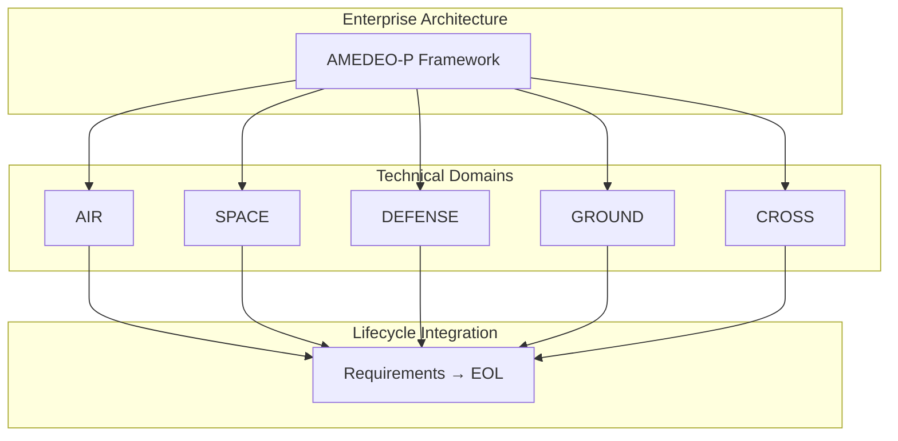
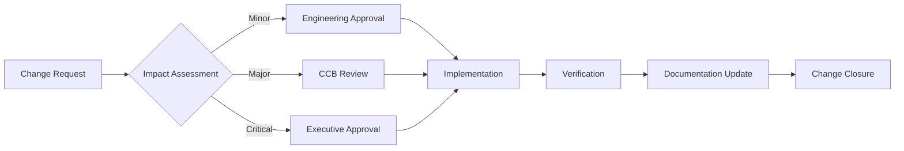
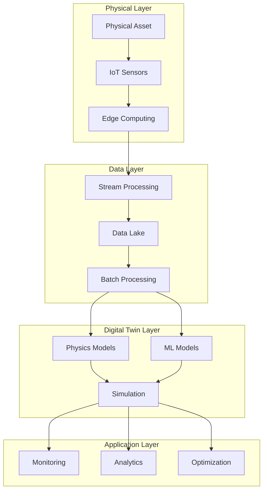

# AMEDEO-P-AEROSPACE-DEFENSE-AND-GROUND-SYSTEMS
## Airframes, Mechanical, Environmental, Digital/Distributed, Energy, Operating, Propulsion Systems (A.M.E.D.E.O.P.).
### Comprehensive framework for next generation systems in every aerospace industry segment: Air, Space, Defense, Ground and Cross domains.

---

# **README**

[]()
[]()
[]()
[]()
[]()
[]()

---

## **📋 Table of Contents**

1. [Overview](#overview)
2. [System Definition](#system-definition)
3. [Architecture](#architecture)
4. [Directory Structure](#directory-structure)
5. [Configuration Item Structure](#configuration-item-structure)
6. [Lifecycle Management](#lifecycle-management)
7. [Standards & Certification](#standards--certification)
8. [Implementation Guide](#implementation-guide)
9. [Digital Thread & Twin](#digital-thread--twin)
10. [Metrics & Analytics](#metrics--analytics)
11. [Contributing](#contributing)
12. [License](#license)
13. [Support](#support)
14. [Version History](#version-history)

---

## **Overview**

**AMEDEO-P** is a comprehensive framework for next-generation aerospace systems engineering, providing complete cradle-to-grave lifecycle management across all aerospace industry segments.

### **Mission Statement**
To establish a unified, traceable, and comprehensive systems engineering framework that seamlessly integrates all aerospace domains while ensuring compliance with international standards and enabling digital transformation across the entire product lifecycle.

### **Core Capabilities**
- **Unified Architecture**: Single framework for all aerospace domains
- **Complete Traceability**: Bidirectional linking from requirements to retirement
- **Digital Twin Integration**: Real-time synchronization and predictive analytics
- **Multi-Standard Compliance**: Pre-configured for global certification requirements
- **Lifecycle Management**: 11-phase comprehensive coverage from concept to recycling

### **System Scale**
- **Total Systems**: 3,920
- **Constituent Assemblies**: 3,920
- **Configuration Items**: 39,200
- **Lifecycle Phases**: 11
- **Documentation Volume**: ~78TB
- **File Architecture**: ~15.7 million items

---

## **System Definition**

### **AMEDEO-P Framework Components**

| Component | Category | Description | Distribution |
|-----------|----------|-------------|--------------|
| **A** | Airframes | Structural systems, materials, and architectural frameworks | 560 systems |
| **M** | Mechanical | Actuation, mechanisms, and kinematic systems | 560 systems |
| **E** | Environmental | Life support, thermal, and protection systems | 560 systems |
| **D** | Digital/Distributed | Computing, networks, and information systems | 560 systems |
| **E** | Energy | Power generation, storage, and distribution | 560 systems |
| **O** | Operating Systems | Procedures, logistics, and operational frameworks | 560 systems |
| **P** | Propulsion | Thrust generation and propulsive systems | 560 systems |

### **Domain Architecture**

| Domain | Scope | Systems | Key Applications |
|--------|-------|---------|------------------|
| **AIR** | Commercial & Civil Aviation | 1,400 | Fixed-wing, Rotorcraft, UAV, eVTOL |
| **SPACE** | Orbital & Deep Space | 700 | Satellites, Launch Vehicles, Spacecraft, Habitats |
| **DEFENSE** | Military & Security | 1,050 | Combat Systems, C4ISR, Electronic Warfare |
| **GROUND** | Infrastructure & Support | 350 | Airports, GSE, ATC, Ground Systems |
| **CROSS** | Multi-Domain Integration | 420 | Common Systems, Interoperability |

### **System Breakdown Structure**

```
AMEDEO-P Framework (3,920 Systems)
├── AIR Domain (1,400 Systems)
│   ├── Airframes (200)
│   ├── Mechanical (200)
│   ├── Environmental (200)
│   ├── Digital/Distributed (200)
│   ├── Energy (200)
│   ├── Operating Systems (200)
│   └── Propulsion (200)
├── SPACE Domain (700 Systems)
│   └── [7 categories × 100 each]
├── DEFENSE Domain (1,050 Systems)
│   └── [7 categories × 150 each]
├── GROUND Domain (350 Systems)
│   └── [7 categories × 50 each]
└── CROSS Domain (420 Systems)
    └── [7 categories × 60 each]
```

---

## **Architecture**

### **Hierarchical Framework**

The AMEDEO-P architecture implements a strict hierarchical decomposition:

```
Enterprise Level
    ↓
Domain Level (5 domains)
    ↓
Category Level (7 categories per domain)
    ↓
System Level (Variable per category)
    ↓
Constituent Assembly Level (1 per system)
    ↓
Configuration Item Level (~10 per CA)
    ↓
Lifecycle Phase Level (11 phases per CI)
```

### **System Integration Model**



### **Data Architecture**

- **Structured Data**: Relational databases for configuration management
- **Unstructured Data**: Document repositories for artifacts
- **Time-Series Data**: Real-time telemetry and sensor data
- **Graph Data**: Traceability and dependency networks

---

## **Directory Structure**

The AMEDEO-P framework follows a comprehensive hierarchical directory structure designed for aerospace systems engineering with complete lifecycle management.

### **Root Level Structure**

```
AMEDEO-P-AEROSPACE-DEFENSE-AND-GROUND-SYSTEMS/
├── .github/                          # GitHub integration and workflows
│   ├── ISSUE_TEMPLATE/               # Issue templates for bug reports, features, CI requests
│   ├── PULL_REQUEST_TEMPLATE/        # PR template with compliance checklists
│   └── workflows/                    # CI/CD pipelines and security scanning
├── docs/                             # Organizational documentation (12 categories)
│   ├── 01-GOVERNANCE/                # Board structure and executive leadership
│   ├── 02-FINANCIAL/                 # Business case with ROI analysis
│   ├── 03-LEGAL-CONTRACTS/           # IP management and export control
│   ├── 04-PROGRAM-MANAGEMENT/        # Program charter and roadmap
│   ├── 05-HUMAN-RESOURCES/           # Personnel and training plans
│   ├── 06-ENGINEERING/               # Technical standards and procedures
│   ├── 07-QUALITY-ASSURANCE/         # QA processes and certification
│   ├── 08-CONFIGURATION-MANAGEMENT/  # CM policies and procedures
│   ├── 09-RISK-MANAGEMENT/           # Risk assessment and mitigation
│   ├── 10-SUPPLIER-MANAGEMENT/       # Vendor qualification and oversight
│   ├── 11-CUSTOMER-RELATIONS/        # Customer engagement and support
│   └── 12-OPERATIONS/                # Daily operations and procedures
├── templates/                        # Lifecycle phase templates
│   ├── 01-REQUIREMENTS/              # Requirements specification templates
│   ├── 02-DESIGN/                    # Design documentation templates
│   ├── 03-BUILDING-PROTOTYPING/      # Development and prototyping templates
│   ├── 04-EXECUTABLES-PACKAGES/      # Build and deployment templates
│   ├── 05-VERIFICATION-VALIDATION/   # Testing and validation templates
│   ├── 06-INTEGRATION-QUALIFICATION/ # Integration testing templates
│   ├── 07-CERTIFICATION-SECURITY/    # Certification documentation templates
│   ├── 08-PRODUCTION-SCALE/          # Production planning templates
│   ├── 09-OPS-SERVICES/              # Operations and service templates
│   ├── 10-MRO/                       # Maintenance and repair templates
│   └── 11-SUSTAINMENT-RECYCLE-EOL/   # End-of-life management templates
├── tools/                            # Automation and utility scripts
│   ├── create-ci.sh                  # Configuration Item creation script
│   ├── validators/                   # Structure and compliance validators
│   ├── generators/                   # Automated content generators
│   └── reports/                      # Reporting and analytics tools
├── UTCS/                             # Unified Traceability & Configuration System
│   ├── AIR/                          # Air domain systems (1,400 systems)
│   ├── SPACE/                        # Space domain systems (700 systems)
│   ├── DEFENSE/                      # Defense domain systems (1,050 systems)
│   ├── GROUND/                       # Ground domain systems (350 systems)
│   └── CROSS/                        # Cross-domain systems (420 systems)
├── CHANGELOG.md                      # Version history and release notes
├── CODE_OF_CONDUCT.md                # Professional conduct standards
├── CONTRIBUTING.md                   # Contribution guidelines with DO-178C compliance
├── IMPLEMENTATION-SUMMARY.md         # Implementation status and capabilities
├── LICENSE.md                        # Proprietary license with export control
├── README.md                         # This comprehensive framework documentation
└── SECURITY.md                       # Security policy and incident response
```

### **UTCS Domain Structure**

Each domain within the UTCS follows the AMEDEO-P categorization:

```
UTCS/{DOMAIN}/
├── Airframes/                        # A - Structural systems and frameworks
├── Mechanical/                       # M - Actuation and kinematic systems
├── Environmental/                    # E - Life support and protection systems
├── Digital_Distributed/              # D - Computing and information systems
├── Energy/                           # E - Power generation and distribution
├── Operating_Systems/                # O - Procedures and operational frameworks
└── Propulsion/                       # P - Thrust generation systems
```

### **Configuration Item Hierarchy**

```
UTCS/{DOMAIN}/{CATEGORY}/
└── System-{ID}-{Name}/               # System level (e.g., System-001-FuselageStructure)
    └── CA-{CategoryCode}{SystemID}/  # Constituent Assembly (e.g., CA-AA001)
        └── CI-{CategoryCode}{SystemID}-{CIID}/  # Configuration Item (e.g., CI-AA001-001)
            ├── 01-REQUIREMENTS/      # Requirements specification and management
            ├── 02-DESIGN/            # Architecture and detailed design
            ├── 03-BUILDING-PROTOTYPING/  # Development and prototyping
            ├── 04-EXECUTABLES-PACKAGES/  # Build artifacts and packages
            ├── 05-VERIFICATION-VALIDATION/  # Testing and compliance verification
            ├── 06-INTEGRATION-QUALIFICATION/  # System integration and qualification
            ├── 07-CERTIFICATION-SECURITY/  # Regulatory approval and security
            ├── 08-PRODUCTION-SCALE/  # Manufacturing and production
            ├── 09-OPS-SERVICES/      # Operations and service documentation
            ├── 10-MRO/               # Maintenance, repair, and overhaul
            └── 11-SUSTAINMENT-RECYCLE-EOL/  # End-of-life management
```

### **Domain Distribution**

| Domain | Systems | Categories | Total CIs | Primary Applications |
|--------|---------|------------|-----------|-------------------|
| **AIR** | 1,400 | 7 × 200 each | 14,000 | Commercial aviation, military aircraft, UAV, eVTOL |
| **SPACE** | 700 | 7 × 100 each | 7,000 | Satellites, launch vehicles, spacecraft, habitats |
| **DEFENSE** | 1,050 | 7 × 150 each | 10,500 | Combat systems, C4ISR, electronic warfare |
| **GROUND** | 350 | 7 × 50 each | 3,500 | Airports, GSE, ATC, ground systems |
| **CROSS** | 420 | 7 × 60 each | 4,200 | Common systems, interoperability components |
| **TOTAL** | **3,920** | **49 categories** | **39,200** | **Complete aerospace ecosystem** |

### **File Organization Standards**

- **Naming Convention**: All files follow aerospace industry naming standards
- **Version Control**: Git-based with branch protection and review requirements
- **Documentation**: Markdown format with standards compliance tracking
- **Metadata**: YAML frontmatter for traceability and classification
- **Security**: Classification levels and export control markings
- **Lifecycle**: 11-phase structure for complete cradle-to-grave management

---

## **Configuration Item Structure**

### **CI Hierarchy and Composition**

Each Configuration Item (CI) represents a discrete, manageable component within a Constituent Assembly (CA). The structure ensures complete lifecycle traceability and management.

### **CI Identification Schema**

```
CI-XXYYYY-ZZZ
│  │  │   │
│  │  │   └── CI Sequential Number (001-999)
│  │  └────── System Sequential Number (001-999)
│  └───────── Category Code (AA, AM, AE, AD, AEN, AO, AP)
└──────────── Domain Code (A=Air, S=Space, D=Defense, G=Ground, X=Cross)
```

### **CI Metadata Structure**

```yaml
configuration_item:
  identification:
    id: CI-AD001-001
    name: Flight_Management_Computer
    version: 2.3.0
    baseline: BASELINE_2025_Q3
    
  classification:
    domain: AIR
    category: Digital_Distributed
    system: FlightManagement
    ca_parent: CA-AD001
    criticality: DAL-A
    classification: UNCLASSIFIED
    itar_controlled: false
    
  lifecycle:
    current_phase: 07-CERTIFICATION
    phase_entry_date: 2025-06-01
    phase_exit_criteria: FAA_Approval
    maturity: TRL-7
    
  technical:
    type: SOFTWARE
    platform: PowerPC_MPC8640D
    language: [C, Ada]
    loc: 450000
    complexity: HIGH
    
  compliance:
    standards:
      - DO-178C_DAL-A
      - ARP4754A
      - DO-254_DAL-A
    certifications:
      - FAA_TSO-C115d
      - EASA_ETSO-C115d
    audits:
      - date: 2025-07-15
        type: Stage_of_Involvement_4
        result: PASS
        
  interfaces:
    internal:
      - CI-AD001-002  # Navigation Database
      - CI-AD001-003  # Performance Calculator
    external:
      - CA-AD002      # Autopilot Assembly
      - CA-AE001      # Display System Assembly
      
  metrics:
    quality:
      defect_density: 0.02
      code_coverage: 99.8
      mc_dc_coverage: 100
    reliability:
      mtbf: 50000
      availability: 0.99999
```

### **CI Lifecycle States**

| State | Description | Allowed Transitions |
|-------|-------------|-------------------|
| **PLANNED** | CI defined but not started | → IN_DEVELOPMENT |
| **IN_DEVELOPMENT** | Active development | → IN_VERIFICATION |
| **IN_VERIFICATION** | Testing and validation | → IN_QUALIFICATION |
| **IN_QUALIFICATION** | Environmental and system testing | → IN_CERTIFICATION |
| **IN_CERTIFICATION** | Regulatory review | → CERTIFIED |
| **CERTIFIED** | Approved for production | → IN_PRODUCTION |
| **IN_PRODUCTION** | Manufacturing phase | → OPERATIONAL |
| **OPERATIONAL** | In service | → MAINTENANCE |
| **MAINTENANCE** | Under MRO | → OPERATIONAL, → RETIRED |
| **RETIRED** | End of life | → DISPOSED |
| **DISPOSED** | Recycled/Destroyed | Terminal state |

---

## **Lifecycle Management**

### **11-Phase Lifecycle Model**

| Phase | Name | Entry Criteria | Exit Criteria | Typical Duration |
|-------|------|---------------|---------------|------------------|
| **01** | Requirements | Stakeholder needs identified | Requirements baselined | 2-4 months |
| **02** | Design | Requirements approved | Design frozen (CDR) | 3-6 months |
| **03** | Building & Prototyping | Design approved | Prototype validated | 4-8 months |
| **04** | Executables & Packages | Code complete | Build released | 1-2 months |
| **05** | Verification & Validation | Build available | Tests passed | 3-6 months |
| **06** | Integration & Qualification | V&V complete | Qualification achieved | 2-4 months |
| **07** | Certification & Security | Qualification passed | Certificate issued | 6-12 months |
| **08** | Production Scale | Certification obtained | Production started | 3-6 months |
| **09** | Operations & Services | Production ready | Deployed to field | Continuous |
| **10** | MRO | In service | Maintained per schedule | 20-30 years |
| **11** | Sustainment & Recycle | Near EOL | Properly disposed | 2-5 years |

### **Phase Gate Reviews**

| Gate | Review | Authority | Key Decisions |
|------|--------|-----------|---------------|
| **G1** | System Requirements Review (SRR) | Chief Engineer | Approve requirements |
| **G2** | Preliminary Design Review (PDR) | Design Authority | Approve approach |
| **G3** | Critical Design Review (CDR) | Technical Director | Freeze design |
| **G4** | Test Readiness Review (TRR) | V&V Manager | Authorize testing |
| **G5** | Qualification Review (QR) | Quality Director | Confirm qualification |
| **G6** | Certification Review (CR) | DER/Certification | Grant approval |
| **G7** | Production Readiness Review (PRR) | Operations VP | Release to production |
| **G8** | Operational Readiness Review (ORR) | Customer | Accept delivery |
| **G9** | End of Life Review (ELR) | Asset Manager | Approve retirement |

### **Change Management Process**



### **Configuration Baselines**

| Baseline | Established At | Contains | Authority |
|----------|---------------|----------|-----------|
| **Functional** | SRR | System requirements | Program Manager |
| **Allocated** | PDR | Preliminary design | Chief Engineer |
| **Design** | CDR | Detailed design | Design Authority |
| **Product** | QR | As-built configuration | Configuration Manager |
| **Operational** | ORR | As-deployed configuration | Operations Manager |

---

## **Standards & Certification**

### **Regulatory Compliance Matrix**

| Domain | Primary Standards | Safety Standards | Quality Standards | Security Standards |
|--------|------------------|------------------|-------------------|-------------------|
| **AIR** | Part 21/23/25/27/29 | DO-178C, DO-254, ARP4754A | AS9100D, ISO 9001 | DO-326A, DO-356A |
| **SPACE** | NASA-STD-8739 | ECSS-Q-ST-40C, ECSS-E-ST-40C | ISO 17025 | CCSDS 350.0-G-3 |
| **DEFENSE** | MIL-HDBK-516C | MIL-STD-882E, MIL-STD-1629A | AQAP-2110 | NIST 800-171 |
| **GROUND** | ICAO Annex 14 | ISO 45001, IATA ISAGO | ISO 14001 | ISO 27001 |
| **CROSS** | ISO/IEC 15288 | IEC 61508, ISO 26262 | CMMI | IEC 62443 |

### **Design Assurance Levels**

| Level | Classification | Failure Condition | Probability | Development Rigor |
|-------|---------------|-------------------|-------------|-------------------|
| **DAL-A** | Level A | Catastrophic | < 10⁻⁹/hr | Full independence |
| **DAL-B** | Level B | Hazardous | < 10⁻⁷/hr | Independence required |
| **DAL-C** | Level C | Major | < 10⁻⁵/hr | Some independence |
| **DAL-D** | Level D | Minor | < 10⁻³/hr | Basic verification |
| **DAL-E** | Level E | No Effect | N/A | Good practice |

### **Certification Artifacts Required**

#### **DO-178C Software Artifacts (DAL-A)**

| Planning | Development | Verification | Configuration | Quality |
|----------|-------------|--------------|---------------|---------|
| PSAC | SRS | SVCP | SCMP | SQAP |
| SDP | SDD | SVR | SCR | SQAR |
| SVP | Source Code | Problem Reports | SCI | SAS |

#### **DO-254 Hardware Artifacts (DAL-A)**

| Planning | Design | Verification | Configuration | Validation |
|----------|--------|--------------|---------------|------------|
| PHAC | HRD | HVCP | HCMP | HVR |
| HDP | HDD | HVP | HCR | HVAS |
| HVP | HDL Code | Problem Reports | | HAS |

---

## **Implementation Guide**

### **Getting Started**

#### **Prerequisites**

```bash
# System Requirements
- OS: Linux (RHEL 8+, Ubuntu 20.04+)
- CPU: 8+ cores
- RAM: 32GB minimum
- Storage: 2TB SSD
- Network: 1Gbps

# Software Requirements
- Git 2.30+
- Python 3.9+
- Docker 20.10+
- PostgreSQL 13+
- Node.js 16+
```

#### **Installation**

```bash
# 1. Clone repository
git clone https://github.com/amedeo-p/aerospace-systems.git
cd amedeo-p-systems

# 2. Run setup script
./scripts/setup-environment.sh

# 3. Initialize database
./scripts/init-database.sh

# 4. Verify installation
./scripts/validate-installation.sh

# 5. Run health check
./scripts/health-check.sh
```

### **Creating Your First CI**

```bash
# Generate new Constituent Assembly
python tools/generators/ca-generator.py \
  --domain AIR \
  --category Digital_Distributed \
  --system FlightManagement \
  --name "Flight Management System Assembly"

# Generate Configuration Item
python tools/generators/ci-generator.py \
  --ca CA-AD001 \
  --name "Flight Management Computer" \
  --criticality DAL-A \
  --type SOFTWARE

# Initialize lifecycle phases
python tools/lifecycle-management/init-phases.py \
  --ci CI-AD001-001 \
  --phases all

# Validate structure
python tools/validators/structure-validator.py \
  --ci CI-AD001-001
```

### **Workflow Example**

```python
# Example: Requirements to Design transition
from amedeo_p import ConfigurationItem, PhaseGate

# Load CI
ci = ConfigurationItem.load("CI-AD001-001")

# Complete requirements phase
ci.complete_phase_activities("01-REQUIREMENTS")
ci.generate_phase_evidence("01-REQUIREMENTS")

# Conduct SRR gate review
gate = PhaseGate("SRR", ci)
gate.conduct_review()
gate.record_findings()
gate.approve_transition()

# Transition to design phase
ci.transition_to_phase("02-DESIGN")
ci.baseline("FUNCTIONAL")
```

### **Integration Points**

| System | Integration Method | Purpose |
|--------|-------------------|---------|
| **PLM** | REST API | Design data management |
| **ALM** | Web services | Requirements management |
| **ERP** | Database sync | Resource planning |
| **MES** | Message queue | Manufacturing execution |
| **CMMS** | File transfer | Maintenance management |

---

## **Digital Thread & Twin**

### **Digital Thread Architecture**

The digital thread provides end-to-end traceability across the entire lifecycle:

```yaml
digital_thread:
  version: 3.0
  
  core_components:
    data_fabric:
      - graph_database: Neo4j
      - document_store: MongoDB
      - time_series: InfluxDB
      - relational: PostgreSQL
      
    integration_layer:
      - message_broker: Apache Kafka
      - api_gateway: Kong
      - service_mesh: Istio
      
    analytics_engine:
      - batch_processing: Apache Spark
      - stream_processing: Apache Flink
      - ml_platform: Kubeflow
      
  traceability_links:
    - requirements_to_design
    - design_to_implementation
    - implementation_to_test
    - test_to_certification
    - certification_to_production
    - production_to_operations
    - operations_to_maintenance
    - maintenance_to_retirement
```

### **Digital Twin Framework**

```json
{
  "digital_twin": {
    "configuration": {
      "twin_id": "DT-FMC-001",
      "physical_asset": "CI-AD001-001",
      "creation_date": "2025-08-01",
      "maturity_level": "Level_4_Predictive"
    },
    
    "models": {
      "physics_based": {
        "thermal": "FEA_thermal_model",
        "structural": "FEA_structural_model",
        "fatigue": "Crack_growth_model"
      },
      "data_driven": {
        "performance": "LSTM_performance_model",
        "anomaly": "Autoencoder_anomaly_model",
        "rul": "Random_forest_RUL_model"
      }
    },
    
    "data_sources": {
      "design": ["CAD", "CAE", "Requirements"],
      "manufacturing": ["As_built", "Quality_data"],
      "operational": ["Sensors", "Maintenance_logs", "Performance_data"]
    },
    
    "synchronization": {
      "frequency": "1Hz",
      "protocol": "MQTT_over_TLS",
      "latency": "<100ms",
      "data_rate": "10MB/s"
    },
    
    "services": {
      "monitoring": "Real_time_health_status",
      "prediction": "Failure_prediction",
      "optimization": "Performance_optimization",
      "simulation": "What_if_analysis"
    }
  }
}
```

### **Implementation Architecture**



---

## **Metrics & Analytics**

### **Framework KPIs**

Since the framework is newly deployed, metrics focus on implementation progress:

| Category | Metric | Initial State | 30-Day Target | 90-Day Target |
|----------|--------|---------------|---------------|---------------|
| **Deployment** | CIs Populated | 0/39,200 | 100 | 1,000 |
| **Documentation** | Artifacts Complete | 0% | 25% | 75% |
| **Training** | Personnel Certified | 0 | 50 | 200 |
| **Integration** | Systems Connected | 0 | 5 | 15 |
| **Compliance** | Standards Mapped | 100% | 100% | 100% |
| **Automation** | Processes Automated | 0% | 30% | 60% |

### **Domain Implementation Priority**

```
Week 1-2:   AIR Domain - Critical flight systems
Week 3-4:   DEFENSE Domain - Mission critical systems  
Week 5-6:   SPACE Domain - Satellite platforms
Week 7-8:   GROUND Domain - Infrastructure systems
Week 9-10:  CROSS Domain - Common components
Week 11-12: Integration and optimization
```

### **Quality Metrics**

| Metric | Definition | Target | Measurement |
|--------|------------|--------|-------------|
| **Requirements Coverage** | % requirements traced | 100% | Automated |
| **Design Compliance** | % meeting standards | 100% | Review-based |
| **Code Coverage** | % code tested | >90% | Tool-based |
| **Defect Density** | Defects/KLOC | <0.1 | Continuous |
| **Review Effectiveness** | Defects found in review | >80% | Calculated |

---

## **Contributing**

### **Contribution Guidelines**

#### **Code Standards**

```c
// C Code Example (MISRA-C:2012 Compliant)
/*******************************************************************************
 * @file    flight_management.c
 * @brief   Flight Management Computer Core Functions
 * @author  AMEDEO-P Team
 * @version 2.3.0
 * @date    2025-08-24
 * 
 * @section License
 * Proprietary and Confidential
 ******************************************************************************/

#include "flight_management.h"

/**
 * @brief Calculate optimal flight path
 * @param[in] origin Origin airport ICAO code
 * @param[in] destination Destination airport ICAO code
 * @param[out] flight_plan Generated flight plan
 * @return Status code (0 = success)
 * @requirement REQ-FMC-001
 * @test TEST-FMC-001
 */
int32_t calculate_flight_path(const char* origin, 
                              const char* destination,
                              flight_plan_t* flight_plan)
{
    /* Implementation */
    return 0;
}
```

#### **Documentation Standards**

- Use Doxygen for code documentation
- Follow Markdown for documentation files
- Include requirement traceability tags
- Provide test case references

#### **Testing Requirements**

- Unit test coverage > 90%
- MC/DC coverage for DAL-A: 100%
- Integration tests required
- System tests mandatory

### **Pull Request Process**

1. **Create Feature Branch**
   ```bash
   git checkout -b feature/CI-XXXYYY-description
   ```

2. **Implement Changes**
   - Follow coding standards
   - Add tests
   - Update documentation

3. **Run Validation**
   ```bash
   ./scripts/pre-commit-validation.sh
   ```

4. **Submit PR**
   - Complete PR template
   - Link to requirements
   - Request reviews

5. **Review Process**
   - Automated checks must pass
   - Two approvals minimum
   - DER approval for certification items

---

## **License**

```
AMEDEO-P Aerospace Defense and Ground Systems
Copyright (c) 2025 - All Rights Reserved

PROPRIETARY AND CONFIDENTIAL

This software and associated documentation contain proprietary information
and trade secrets of AMEDEO-P Aerospace Defense and Ground Systems. Any
unauthorized use, reproduction, or distribution is strictly prohibited and
may result in severe civil and criminal penalties.

Licensed Software: AMEDEO-P Framework v3.0.0
License Type: Enterprise
License Number: AMP-ENT-2025-001

Permitted Uses:
- Internal development and deployment
- Creation of derivative works for internal use
- Integration with authorized third-party systems

Restrictions:
- No external distribution without written consent
- No reverse engineering or decompilation
- No removal of proprietary notices
- Modifications require approval

Export Control:
This software is subject to export control laws and regulations.
ITAR and EAR compliance required for international transfers.

Patent Notice:
This software may be covered by one or more patents or patent applications.

Contact Information:
Legal Department: legal@amedeo-p.aero
Licensing: licensing@amedeo-p.aero
Compliance: compliance@amedeo-p.aero

By accessing this software, you acknowledge that you have read,
understood, and agree to be bound by these license terms.
```

---

## **Support**

### **Support Structure**

| Level | Type | Channel | Response Time | Availability |
|-------|------|---------|---------------|--------------|
| **L1** | Critical System Down | hotline@amedeo-p.aero<br>+1-555-AMEDEO-1 | 15 minutes | 24/7/365 |
| **L2** | Major Issue | priority@amedeo-p.aero | 1 hour | 24/7/365 |
| **L3** | Standard Support | support@amedeo-p.aero | 4 hours | Business hours |
| **L4** | Questions/Training | help@amedeo-p.aero | 24 hours | Business hours |

### **Support Resources**

#### **Documentation**
- **User Manual**: https://docs.amedeo-p.aero/user-guide
- **Admin Guide**: https://docs.amedeo-p.aero/admin-guide
- **API Reference**: https://docs.amedeo-p.aero/api
- **Best Practices**: https://docs.amedeo-p.aero/best-practices

#### **Training**
- **Basic Training**: 40-hour course for new users
- **Advanced Training**: 80-hour course for administrators
- **Certification Training**: 120-hour course for DERs
- **Online Academy**: https://academy.amedeo-p.aero

#### **Community**
- **Forum**: https://community.amedeo-p.aero
- **Knowledge Base**: https://kb.amedeo-p.aero
- **Stack Overflow**: Tag `amedeo-p`
- **GitHub Discussions**: https://github.com/amedeo-p/discussions

### **Professional Services**

| Service | Description | Duration | Contact |
|---------|-------------|----------|---------|
| **Implementation** | Full deployment assistance | 3-6 months | services@amedeo-p.aero |
| **Migration** | Legacy system migration | 6-12 months | migration@amedeo-p.aero |
| **Customization** | Custom feature development | Variable | custom@amedeo-p.aero |
| **Training** | On-site training programs | 1-2 weeks | training@amedeo-p.aero |
| **Audit** | Compliance audit services | 2-4 weeks | audit@amedeo-p.aero |

---

## **Version History**

### **Current Release**

| Version | Date | Status | Description |
|---------|------|--------|-------------|
| **3.0.0** | 2025-08-24 | CURRENT | Complete framework with 11-phase lifecycle |

### **Release Notes v3.0.0**

#### **New Features**
- Complete 11-phase lifecycle management
- 39,200 Configuration Items structure
- Digital Twin integration framework
- Multi-domain architecture (AIR, SPACE, DEFENSE, GROUND, CROSS)
- Automated compliance checking
- Real-time traceability

#### **Improvements**
- Enhanced directory structure
- Comprehensive templates for all phases
- Integrated certification workflows
- Advanced metrics and analytics

#### **Known Issues**
- Initial deployment requires manual configuration
- Database initialization takes 30-60 minutes
- Large file uploads limited to 1GB

#### **Breaking Changes**
- New directory structure incompatible with v2.x
- Database schema completely redesigned
- API endpoints restructured

### **Roadmap**

| Version | Target Date | Planned Features |
|---------|------------|------------------|
| **3.1.0** | 2025-09-30 | AI-powered analytics, Enhanced automation |
| **3.2.0** | 2025-12-31 | Blockchain integration, Quantum-safe crypto |
| **4.0.0** | 2026-03-31 | Full autonomy, Self-healing systems |

### **Deprecation Notice**

Version 2.x will be deprecated on 2026-01-01. All users must migrate to 3.x by this date.

---

<div align="center">

# **AMEDEO-P AEROSPACE DEFENSE AND GROUND SYSTEMS**
## **Engineering Excellence from Concept to Retirement**

[]()
[]()
[]()
[]()

**The Future of Aerospace Systems Engineering**

</div>

---

**© 2025 AMEDEO-P Aerospace Defense and Ground Systems. All Rights Reserved.**

**Document Version**: 3.0.0 | **Last Updated**: August 24, 2025 | **Classification**: PROPRIETARY
